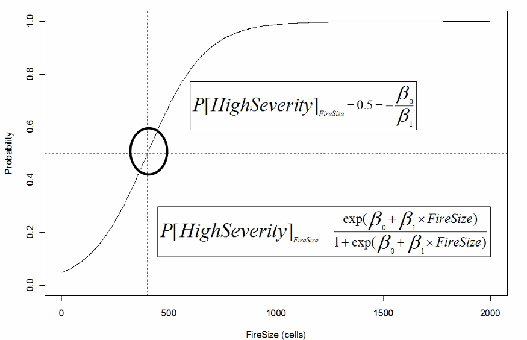

# Burn Severity

Burn Severity in Boreal ALFRESCO is modeled to reflect the following two assumptions (Duffy et al. 2007):

1. Burn Severity increases w/ Firesize (as a consequence of sub-regions of larger fires burning more severely as opposed to a uniform increase in burn severity).
1. Fires burning in the Flats have greater spatial correlation in burn severity than those burning in complex topography.

Algorithm:

1. Ignition of cell -> Assign Low Severity
1. As a fire spreads, a logistic probability function is used to assign severity to each burned cell (slope and intercept user specified in .fif).

  ```
  IF (rand.uniform(0,1) < Prob[High Severity Fire]) Severity = High, ELSE Severity = (Low or Moderate)
  ```

1. Select Severity sub-category from the binary partition above. High severity fires can have either Low or High surface severity, and also partition the Low or Moderate severity fires. The ‘decision’ weights are user specified in .fif.

  ```
  IF (Init.severity = High && rand.uniform(0,1) < High.LSS.HSS.wt) severity = High + HSS, ELSE severity = High + LSS
  ```

  ```
  IF (Init.severity = Low.Mod && rand.uniform(0,1) < Low.Mod.wt) severity = Moderate, ELSE severity = Low
  ```

1. A second set of decision weights (user specified in .fif) are used to determine if topographical influences override the severity assignment resulting from 2) and 3) above.

  ```
  IF (Topography = Flat && rand.uniform(0,1) < Flats.Topo.wt) severity -> ‘Spreader Cell Severity’
  ```

  ```
  IF (Topography = Complex && rand.uniform(0,1) < Complex.Topo.wt) Severity -> ‘Spreader Cell Severity’
  ```

 